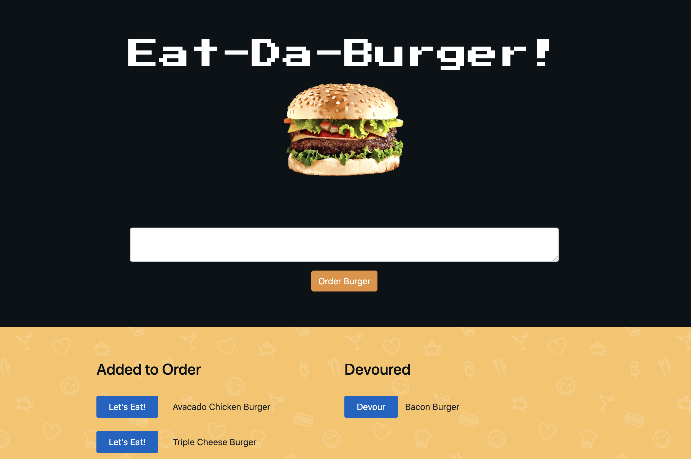

# Eat-Da-Burger!
A burger logger with MySQL, Node, Express, Handlebars and a homemade ORM. You can add a new burger, move the burger from your "Added to Order" list and into your "Devoured" list and then remove when it's gone!

<br>

- - - 

<br>

### Overview

Eat-Da-Burger! is a restaurant app that lets users input the names of burgers they'd like to eat.

[Live Application](https://tranquil-beyond-36026.herokuapp.com/)



<br>

- - - 


### Goals Achieved

* Build a burger app allowing users to:

  * Add a any burger by name
  * Burger is added to left of page on Added List
  * Burger can be moved using the **Lets Eat** button and will move to the right of the page in the Devoured list
  * Use to **Devour** button to remove burger when finished

<br>

- - - 

<br>

### Structure

```
.
├── config
│   ├── connection.js
│   └── orm.js
│ 
├── controllers
│   └── burgers_controller.js
│
├── db
│   ├── schema.sql
│   └── seeds.sql
│
├── models
│   └── burger.js
│ 
├── node_modules
│ 
├── package.json
│
├── public
│   └── assets
│       ├── css
│       │   └── burger_style.css
│       └── img
│           └── burger.png
│   
│
├── server.js
│
└── views
    ├── index.handlebars
    └── layouts
        └── main.handlebars
```
<br>

- - -

<br>

### Hosting on Heroku

The app is hosted by Heroku and can be viewed here: [Live Application](https://tranquil-beyond-36026.herokuapp.com/)

<br>

- - -
<br>


#### Contributor
##### Ashley Hunt
##### * [GitHub](https://github.com/ashhunt07)
##### * [Contact](https://ashhunt07.github.io/portfolio/contact.html)
